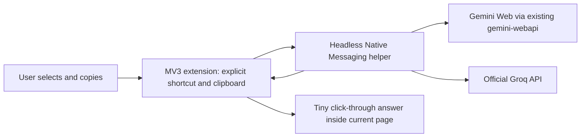

# Invisible AI Assistant — browser-first version

Select the question and options normally, press **Ctrl+C**, then **Ctrl+Shift+V**. A six-pixel pulsing dot appears in the bottom-right of the current webpage. An MCQ answer is only its label, such as **C**; a normal question receives one concise sentence. The answer disappears after 12 seconds by default. **Ctrl+Shift+H** hides it sooner.

The extension never navigates, opens a tab or popup, requests fullscreen exit, or focuses its answer during this workflow. The displayed element is fixed 20 CSS pixels from the bottom/right, click-through, and confined to the viewport. No UI element exists at idle. A lightweight content listener handles the explicit shortcut; it does not monitor clipboard changes or read page content.

## Install the ready-built version

Requires Windows 10/11 x64, Chrome or Edge 116 or newer. The installer includes the .NET runtime and Gemini runtime; users do not install Python or .NET themselves.

1. Download the Windows build artifact from this repository's GitHub Actions run, or use the locally built `InvisibleAI/artifacts/browser-first-release` folder. Extract the archive first.
2. Double-click **InvisibleAI.Setup.exe** once. It installs the helper into `%LOCALAPPDATA%\InvisibleAI\helper` and registers it for Chrome and Edge under the current Windows user. No administrator access, PowerShell, Extension ID entry or manual Native Messaging registration is needed. Upgrades stop the old invisible companion and remove its own startup entry, preserving provider credentials and preferences. Close any old companion settings window before upgrading.
3. Restart Chrome/Edge after installation.
4. Open **chrome://extensions** or **edge://extensions**, enable Developer mode, choose **Load unpacked**, and select the extracted **BrowserExtension** directory containing `manifest.json`. For a source build, choose `InvisibleAI/BrowserExtension/dist` instead.
5. Open the extension's icon and choose **AI Provider settings**. Connect a provider as described below. You can close the settings tab afterward.

**Store publication is still pending.** Loading unpacked is the supported local distribution process; this repository does not claim one-click store installation. A store release must update the helper's allowed origins for its actual store-assigned extension IDs. The bundled manifest public key fixes the unpacked extension ID automatically, so users never enter it themselves.

If Windows/browser application control blocks an unsigned executable or Developer mode, installation cannot proceed in that environment. The application does not bypass those controls. The generated installer is currently unsigned.

## First-time provider setup

Only the provider selected in settings handles subsequent requests. There is no fallback.

**Groq**

1. Choose **Groq**.
2. Paste your own Groq API key from your [Groq account](https://console.groq.com/keys) into **Groq API Key**.
3. Click **Connect / Save**. The helper authenticates against the official Groq model endpoint and loads usable models available to that key.
4. Choose an available model from the dropdown and click **Connect / Save** again if you changed it. Leave the credential field blank to keep the saved key.

**Gemini Web**

1. Sign into your own account at [Gemini Web](https://gemini.google.com/).
2. In your browser's developer tools, inspect an authenticated request to `gemini.google.com` in the Network panel and copy your own Cookie request header containing `__Secure-1PSID` and, when present, `__Secure-1PSIDTS`. Copying both from the same session is recommended. Do not share this header or paste it into chat, logs, URLs or repository files.
3. Choose **Gemini Web** and paste that header into the masked **Gemini Cookies** field.
4. Click **Connect / Save**, then choose an available account model and save if changed. A Google Gemini API key is neither used nor required.

**Test Connection** checks the currently chosen provider and saved credential, refreshes its model catalog, and saves the currently chosen model. Connection/catalog success does not guarantee generation quota. If cookies expire, replace them in the same field and reconnect. Saved credentials are never filled back into the form; the password field clears immediately on submission. An empty field reuses the selected provider's saved credential.

**Advanced** contains answer duration (2–60 seconds) and the existing assistant/text/network privacy gates. Save advanced preferences separately. Network requests disabled in a previous installation stay disabled until explicitly enabled here. Screen capture is not exposed or used in this version.

The helper configuration and credentials belong to the current Windows account and are shared between that account's Chrome and Edge installations. This is not a multi-user web server or database; Windows account credential isolation replaces web authorization/RLS. Other applications running as the same Windows user are within the OS trust boundary.

## Architecture



- **BrowserExtension** owns keyboard commands, a fixed page overlay, the simple settings page, and an offscreen clipboard reader. The offscreen document never opens a visible window or tab. It reads plain text only following explicit invocation, clears its temporary field, and does not write to the clipboard.
- **LocalHelper** reuses `AIService`, both existing provider adapters, model discovery, sanitized errors, cancellation and Windows Credential Manager. Native Messaging launches it automatically. It has no display, tray, global hooks, screen capture, named-pipe companion bridge, startup entry, or local HTTP server.
- **Gemini worker** remains the existing maintained Web client integration. It is bundled as `GeminiWorker.exe`, so there is no separate Python setup. Authentication passes only through a private subprocess stdin channel; request text and optional provider image buffers remain in memory. Cookie caching, browser-cookie discovery and dependency logging remain disabled. Gemini requests use temporary chats.
- **Installer** performs per-user registration using the extension's stable public-key-derived identity. Native requests are accepted only from the registered extension origin; arbitrary credential targets or client-supplied Windows user IDs are rejected.
- **Shared/Protocol** keeps versioned JSON/stdin framing and correlation IDs. Results contain `content`, `provider`, `model`, `usage` and `finishReason`, never credentials. Provider test/model routes remain private Native Messaging RPC paths, not public HTTP endpoints.

MCQ prompting requires only the actual option label for arbitrary A–Z labels, including labeled True/False. Response normalization removes harmless answer prefixes and explanation text when a valid leading label is supplied, and returns **Uncertain** when no valid label can be established. It never selects an option from an ambiguous answer. AI answers can still be wrong; no confidence or correctness guarantee is made.

A new request cancels the previous request for that tab. Correlation IDs prevent late replies from replacing the latest answer. Changing provider/privacy settings cancels active requests. The answer auto-hides; a processing timeout also ensures an abandoned processing dot eventually disappears.

## Removed from the previous version

The WPF Windows companion, system tray, Windows overlay/expanded window, global hotkeys, desktop clipboard service, region-selection/capture windows, startup registration, resident companion bridge, manually registered native executable, and old Install/Uninstall/Setup-Gemini PowerShell setup scripts have been removed from tracked source. Screen-share exclusion and `WDA_EXCLUDEFROMCAPTURE` are not part of this version. Provider-level image methods remain reusable internally; no screenshot workflow or capture permission is required.

## Browser fullscreen and shortcut limits

The browser viewport overlay is compatible with F11 fullscreen by construction: it is page content rather than a desktop overlay. Page-initiated DOM fullscreen is also handled by moving the existing indicator inside `document.fullscreenElement`. No production code changes browser fullscreen state.

Chrome/Edge extension commands bind **Ctrl+Shift+V** and **Ctrl+Shift+H**. Change their bindings at `chrome://extensions/shortcuts` or `edge://extensions/shortcuts`. Browser/OS command conflicts can leave a shortcut unassigned. The popup reports this, and a trusted top-frame page key event provides a Ctrl+Shift+V fallback on ordinary HTTP/HTTPS pages. No normal Ctrl+C/V/X/Z event is intercepted. The fallback remains Ctrl+Shift+V even if the extension command is reassigned. Focused cross-origin embedded frames may require the browser command to be assigned, because the fallback listens in the top frame.

Browser internal pages, extension stores, protected viewer surfaces, some managed browsers and pages that remove/block injected content cannot show this UI. A restricted-page command shows a small action badge when possible. Local files are not included in the page fallback's matches. No DRM, secure desktop, lockdown, anti-cheat or application protection is bypassed.

**Physical F11 key tests and complete Chrome integration are still manual acceptance checks in this environment.** Edge normal-mode integration and its browser fullscreen state have separate recorded evidence; do not interpret an API-entered fullscreen test as an actual F11 keypress test. See `VERIFICATION.md` for exactly what was run.

## Build from source (developers only)

Install .NET SDK 10, Node 22, Python 3.11 and the development dependencies. From the repository root:

```powershell
python -m pip install -r InvisibleAI/LocalHelper/AI/GeminiWeb/requirements.txt -r InvisibleAI/Scripts/requirements-dev.txt
./InvisibleAI/Scripts/Build.ps1
./InvisibleAI/Scripts/Publish.ps1
```

`Build.ps1` runs Ruff, Python tests, .NET compilation/tests, npm lint, type checks and unit tests. `Publish.ps1` creates a self-contained x64 helper, bundles the existing Python worker with PyInstaller, embeds the complete package into `artifacts/browser-first-release/InvisibleAI.Setup.exe`, and copies the built extension alongside it. Only developer build commands use PowerShell/Python. These are not installation steps for users. Generated binaries/runtimes/test profiles are Git-ignored. GitHub Actions performs the build and uploads packages; a remote workflow's result must be checked separately from local results.

## Automated browser integration tests

These tests use the production extension and real helper/session/provider adapters with synthetic credentials and mocked upstream transports. No Google/Groq account is contacted. The test host exists only in the test executable and is not included in the release.

```powershell
cd InvisibleAI/BrowserExtension
npx playwright install chromium
cd ../..
./InvisibleAI/Scripts/Test-Browser.ps1 -Browser Edge
./InvisibleAI/Scripts/Test-Browser.ps1 -Browser Chrome
```

The wrapper temporarily registers a fixture host, uses disposable profiles and restores the previous native-host registration in `finally`. Browser smoke tests cover both provider choices, settings/model catalogs, processing dot, MCQs, A–F, labeled True/False, normal/long text, empty/image-only clipboard, pointer pass-through, focus, answer expiry, no navigation/new tabs, normal copy/paste/cut/undo, browser fullscreen via API, and request replacement. Browser test output is written under ignored `artifacts/qa`. Close another running fixture test before starting these tests. Chrome for Testing needs to start successfully; an executable startup failure is an environment limitation, not a passing Chrome test.

## Exact manual acceptance test

Perform these steps independently in **Chrome normal, Chrome F11, Edge normal, Edge F11**. Configure your own real provider through the masked settings page; repeat once for each provider.

1. On an ordinary webpage, select and copy `What is the capital of France?` with options `A. Berlin`, `B. Madrid`, `C. Paris`, `D. Rome`. Press Ctrl+Shift+V. Confirm a pulsing dot, then only **C**, at the bottom-right. Do not click the extension icon during the request. Verify URL, tab, focus and fullscreen remain unchanged.
2. Repeat with `Python is dynamically typed. A. True B. False`: expect **A**. Copy a genuine six-option question and verify its actual label, including E/F where appropriate. Try a labeled False question and verify its label, not the word False. Use a question with G or further labels too.
3. Copy `Explain binary search in one sentence.`: expect a concise direct answer. Try a long question under 50,000 characters; larger input should produce a short limit error.
4. Click, select, drag and scroll beneath the answer; verify nothing is blocked and no focus is stolen. Wait for expiry. Verify Ctrl+Shift+H hides the response. Trigger another request while one is processing; only the newest answer may remain.
5. Verify ordinary Ctrl+C/V/X/Z in editable page fields. Test an empty clipboard and a clipboard containing only an image: a short error should appear and no question should be generated.
6. Open settings explicitly, switch provider, connect/save, return to the same webpage and repeat. Verify no fallback. Test an invalid key, expired cookies, unavailable model and disabled network/text privacy settings; errors must be sanitized and the password field empty.
7. Exit/restart the browser. Confirm saved preferences work without manually starting any helper. Disconnect the network and repeat an explicit request to verify the timeout/error path. Leave idle: there must be no visible overlay and no screen/clipboard uploads.

Live authentication, model permissions/quota and physical F11 behavior cannot be certified without executing these manual tests. Never paste credentials into issue reports or test logs.

## Changed source files

- `BrowserExtension/manifest.json`, `src/background/service-worker.ts`, `src/protocol.ts`: browser shortcut routing, privacy/cancellation, clipboard permissions, fixed extension identity and helper protocol.
- `BrowserExtension/src/content/overlay.ts`, `src/offscreen/index.html`, `src/offscreen/clipboard.ts`: the viewport indicator/response and explicit clipboard reader; old selection-only script removed.
- `BrowserExtension/src/settings/*`, `src/popup/*`, `src/styles.css`, `src/ui.ts`: simple provider connection/model setup, masked write-only credential entry, instructions and advanced privacy controls.
- `LocalHelper/AI/*` and `LocalHelper/Settings/*`: existing providers, credential store and configuration moved from WindowsCompanion with updated namespaces; `AnswerPolicy.cs` and streamlined settings added.
- `LocalHelper/Program.cs`, `Session.cs`, `InvisibleAI.Helper.csproj`: direct headless Native Messaging host and safe write-only settings API.
- `Installer/Program.cs`, `InvisibleAI.Setup.csproj`, `Shared/Protocol/ExtensionIdentity.cs`, `schema.json`: self-contained installation and protocol identity/schema; obsolete pipe Identity removed.
- `Tests/Program.cs`, `ProviderTests.cs`, `test_gemini_worker.py`, test project; `BrowserExtension/tests/*`, `scripts/browser-smoke.mjs`: reused/adapted provider/security tests plus actual browser integration harness.
- `Scripts/Build.ps1`, `Publish.ps1`, `Test-Browser.ps1`, development requirements; extension package/build/lint/type configurations; solution, Git ignore/environment example, CI workflow and documentation.
- Remaining tracked `WindowsCompanion` UI/tray/hotkey/capture/native-bridge source and the old installation/runtime-setup scripts removed.

### Shortcut shows an old "Settings → AI" error

If extension settings already show a saved provider/model but Ctrl+Shift+V still shows the old desktop message, an older `InvisibleAI.Companion.exe` tray application may still own the global shortcut and have cached pre-connection settings. Exit that old tray application; keep the browser extension and its headless helper. The updated installer retires the previously installed companion automatically. Do not launch the old `InvisibleAI/app/InvisibleAI.Companion.exe` again. The new extension stores the current configuration through the helper and needs no tray app.
